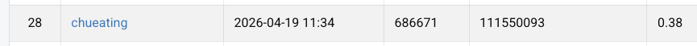
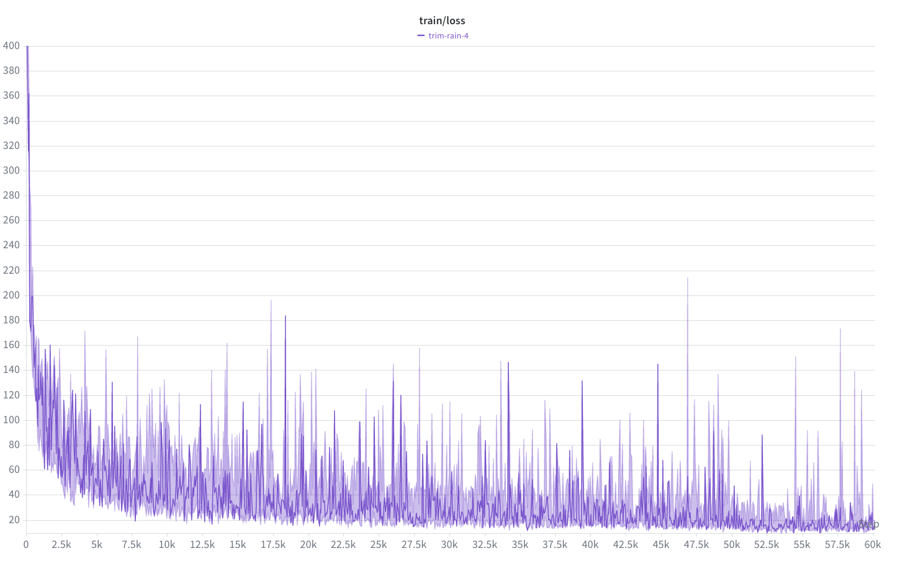
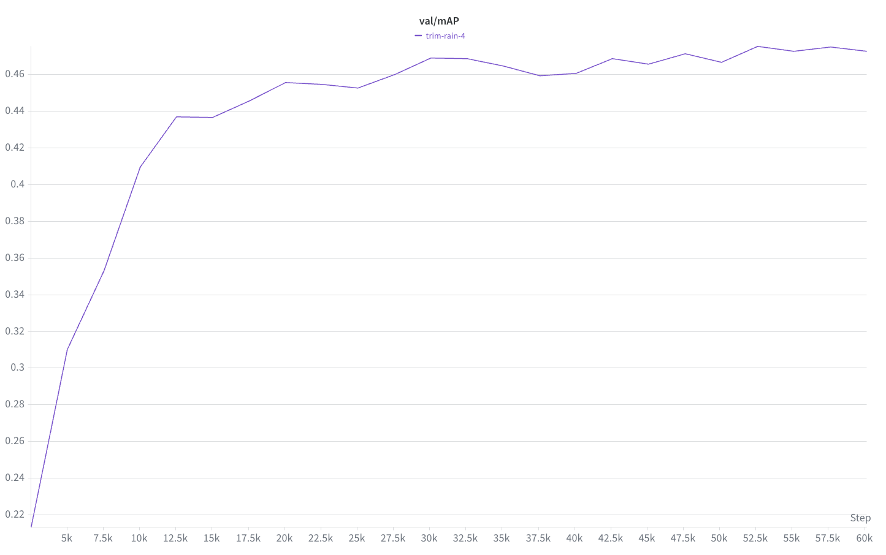
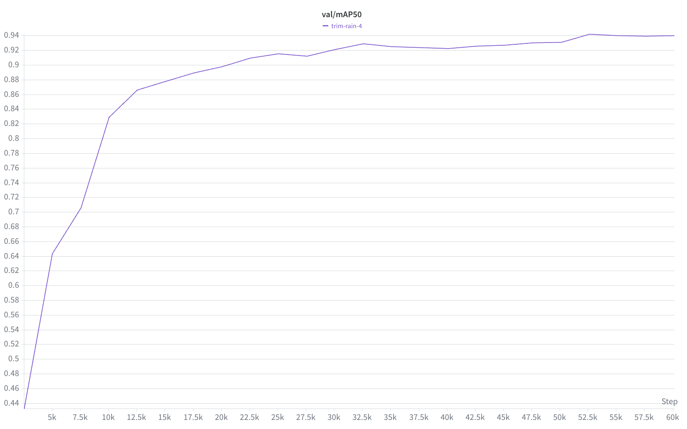

# NYCU VRDL HW2: Digit Detection

> [!NOTE]
> Author: 朱驛庭 (Yi-Ting, Chu)
> StudentID: 111550093

## Introduction

This task is to locate and recognize digits (0–9) in street-view images using a detection model built on the **DETR** family. The dataset is provided by the course: **30,062** training images, **3,340** validation images, and **13,068** test images, annotated in COCO format with 10 categories (digits 0–9).

The homework rules require **DETR with a ResNet-50 backbone**, and forbid using any pretrained DETR/Deformable-DETR weights — only the ImageNet-pretrained ResNet-50 backbone is allowed. Under this constraint, vanilla DETR converges too slowly to reach a competitive score within a reasonable training budget.

This work therefore implements **[DINO](https://arxiv.org/abs/2203.03605) (DETR with Improved DeNoising Anchor Boxes)** from scratch, incorporating:
- **Deformable multi-scale attention** for faster convergence and better small-object recall
- **Contrastive DeNoising (CDN)** queries to stabilize Hungarian matching during early training
- **Mixed query selection** + **look-forward-twice** box refinement

Trained from scratch on 2× RTX 4090 for only 24 epochs (~8 hours), our model reaches **val mAP = 0.4726** / **mAP@0.5 = 0.9400**, well above the strong baseline (0.38).

For full methodology, see the [report](/111550093_HW2.pdf).

## Requirements

- Python 3.10
- PyTorch 2.6.0 with CUDA 12.4
- torchvision 0.21.0
- pycocotools, scipy, numpy, wandb

It is recommended to use a virtual environment. The following commands are for Conda.

```bash
conda create --name vrdl-hw2 python=3.10 -y
conda activate vrdl-hw2
pip install -r requirements.txt

# Build the custom MSDeformAttn CUDA op
bash src/models/ops/make.sh
```

## Dataset

Download the dataset and place it at `data/nycu-hw2-data/` with the following structure:

```
data/nycu-hw2-data/
├── train/              # 30,062 training images
├── valid/              # 3,340 validation images
├── test/               # 13,068 testing images
├── train.json          # COCO-format annotations for training
└── valid.json          # COCO-format annotations for validation
```

## How to Use

### Train

Single-GPU training:
```bash
bash scripts/train.sh
```

Multi-GPU DDP training (the configuration used for our reported results — 2× RTX 4090, batch size 6 per GPU, 24 epochs, ~8 hours):
```bash
CUDA_VISIBLE_DEVICES=1,2 PYTORCH_CUDA_ALLOC_CONF=expandable_segments:True \
  torchrun --nproc_per_node=2 -m src.main \
  --output_dir outputs/dino_r50_4scale --batch_size 6
```

### Evaluate

Evaluate the best checkpoint on the validation set:
```bash
bash scripts/eval.sh
```

### Inference

Generate `pred.json` on the test set (COCO detection format):
```bash
bash scripts/infer.sh
# -> outputs/dino_r50_4scale/pred.json
```

## Performance

**Validation results over 24 epochs.** The LR drops at epoch 20 (StepLR, ×0.1), yielding the peak mAP at epoch 20.

| Epoch      | mAP    | mAP@0.5  | mAP@0.75 |
| :--------- | :----: | :------: | :------: |
| 0          | 0.1943 | 0.3888   | 0.1620   |
| 5          | 0.4367 | 0.8780   | 0.3556   |
| 11         | 0.4689 | 0.9217   | 0.3919   |
| 19         | 0.4668 | 0.9314   | 0.3875   |
| 20 (peak)  | **0.4754** | **0.9422** | **0.4009** |
| 23 (final) | 0.4726 | 0.9400   | 0.3988   |

**Leaderboard screenshot.**



**Training loss.**



**Validation mAP.**



**Validation mAP@0.5.**



For more details and analysis, please see the [report](/111550093_HW2.pdf).

## Repository Structure

```
├── src/
│   ├── main.py                    # Entry point: train / eval / inference
│   ├── engine.py                  # Per-epoch train/eval loops (W&B logging)
│   ├── datasets/
│   │   ├── nycu_hw2.py            # COCO-format dataset loader
│   │   └── transforms.py          # Multi-scale augmentation (no flip)
│   ├── models/
│   │   ├── dino.py                # DINO top-level model
│   │   ├── backbone.py            # ResNet-50 + positional encoding
│   │   ├── deformable_transformer.py  # Encoder/decoder with LFT, mixed selection, two-stage
│   │   ├── dn_components.py       # Contrastive DeNoising (CDN)
│   │   ├── matcher.py             # Hungarian matcher
│   │   ├── criterion.py           # Focal + L1 + GIoU losses
│   │   └── ops/                   # Custom MSDeformAttn CUDA op (AMP-safe)
│   └── util/                      # box_ops, misc helpers
├── configs/
│   └── dino_4scale_r50.py         # Hyperparameters (canonical DINO settings)
├── scripts/
│   ├── train.sh                   # Single-GPU training
│   ├── train_ddp.sh               # DDP training
│   ├── eval.sh                    # Validation mAP
│   └── infer.sh                   # Generate pred.json
├── data/                          # Place dataset here
│   └── nycu-hw2-data/
├── report/                        # LaTeX source + figures
│   ├── report.tex
│   ├── egbib.bib
│   └── assets/
├── outputs/                       # Checkpoints, logs, pred.json
├── 111550093_HW2.pdf              # Project report
├── requirements.txt
└── README.md
```

## References

- Carion et al., *End-to-End Object Detection with Transformers* (DETR), ECCV 2020.
- Zhu et al., *Deformable DETR*, ICLR 2021.
- Li et al., *DN-DETR*, CVPR 2022.
- Zhang et al., *DINO: DETR with Improved DeNoising Anchor Boxes*, ICLR 2023.
