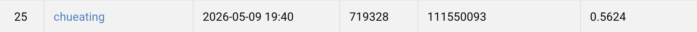
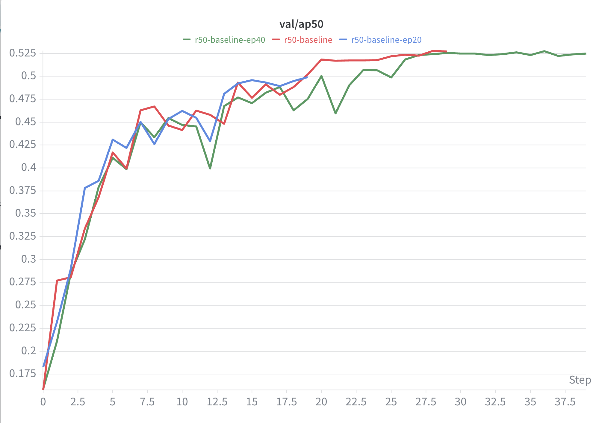
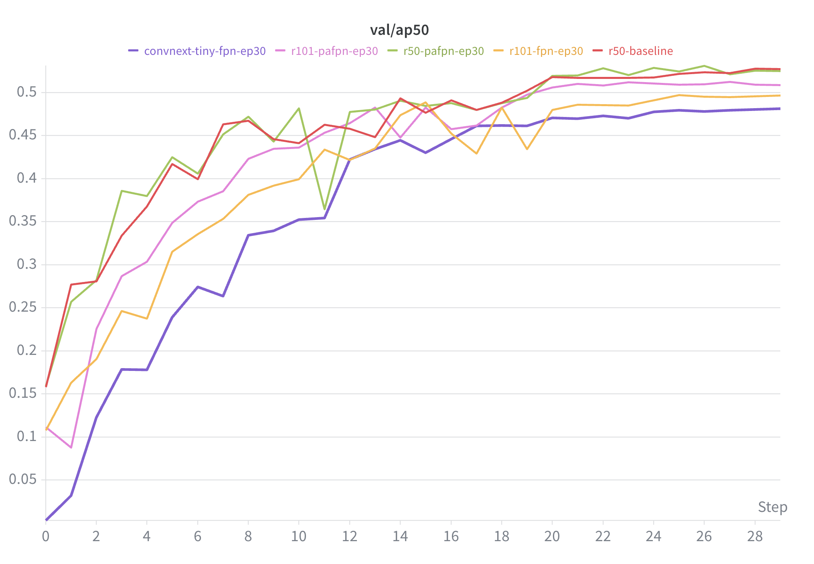
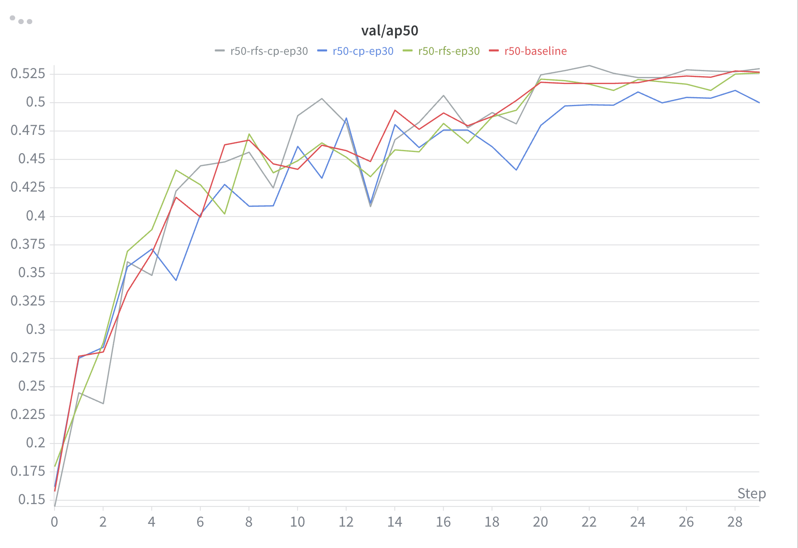
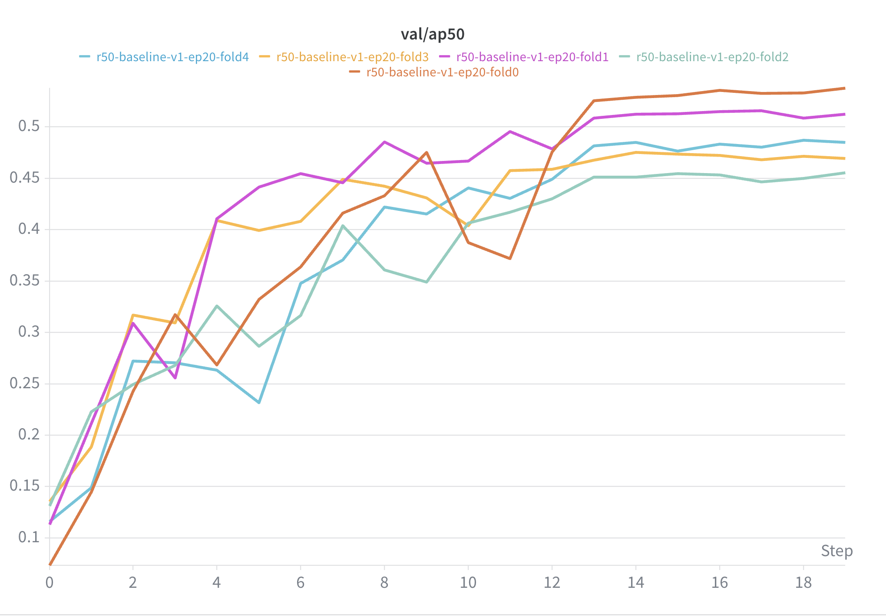
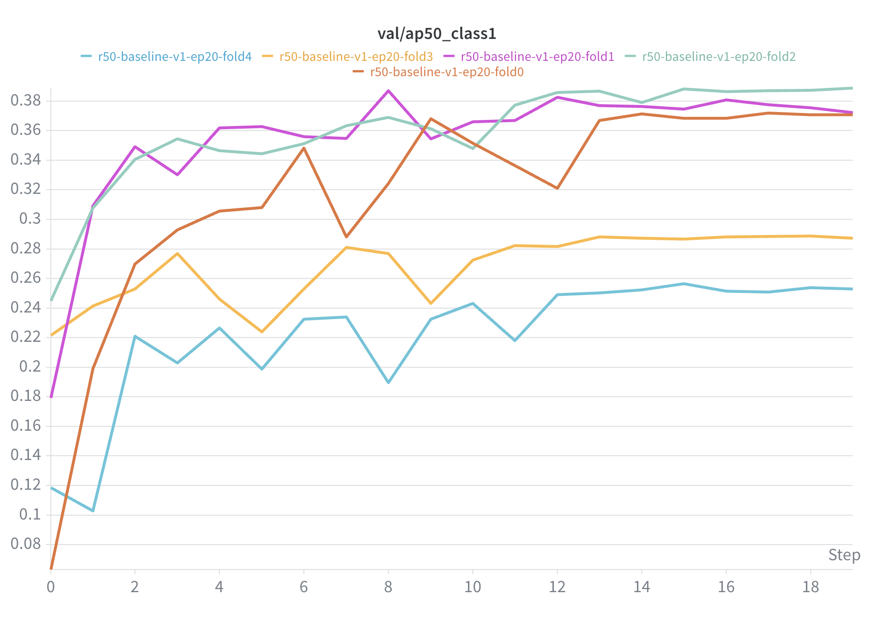
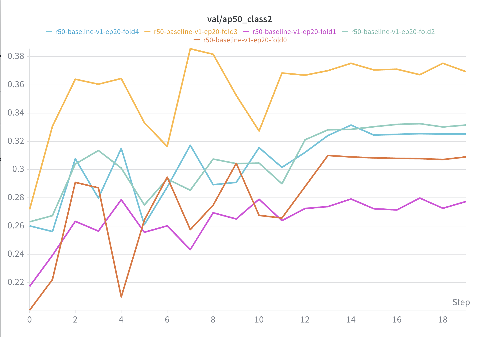
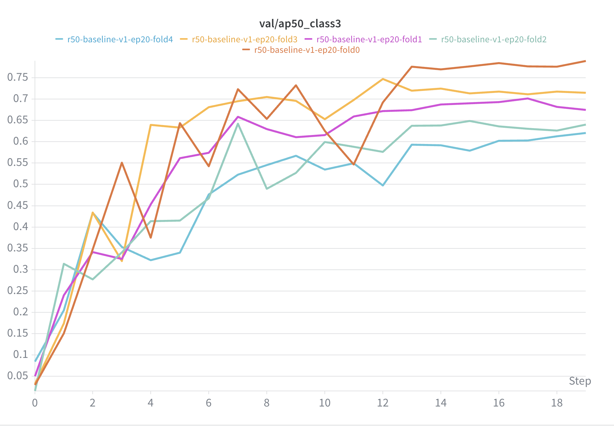
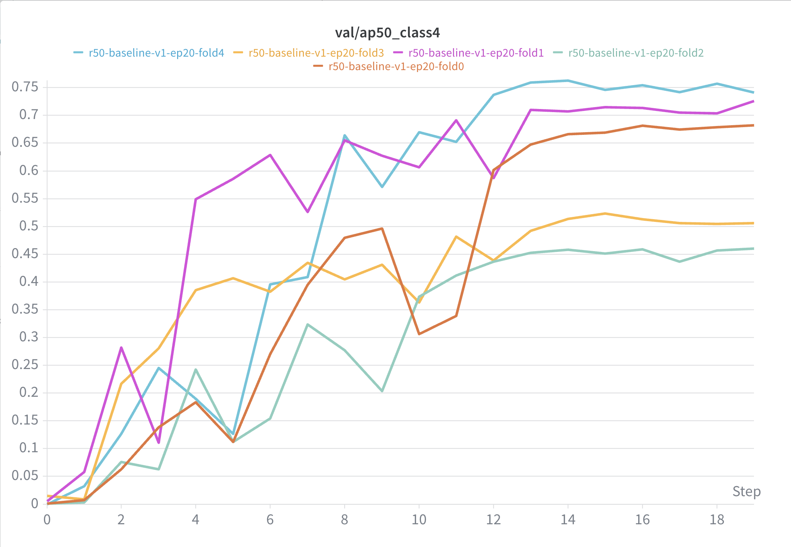

# HW3 - Instance Segmentation

## Introduction

This project solves the VRDL 2026 Spring HW3 colored medical image instance segmentation task. The dataset contains 209 training images and 101 test images in TIFF format. Each training sample provides `image.tif` plus class-specific masks (`class1.tif` ... `class4.tif`), where each non-zero unique pixel value denotes one object instance.

Key techniques implemented for ablation:

- **Baseline**: TorchVision Mask R-CNN with ResNet-50-FPN and ImageNet-pretrained weights.
- **Backbone ablation**: `resnet50`, `resnet101`, and `convnext_tiny`.
- **FPN ablation**: optional PANet-style bottom-up path augmentation (`--use-pafpn`).
- **Mask loss ablation**: standard BCE or BCE + Dice (`--mask-loss {bce,dice}`).
- **Small-object setup**: small anchors and high `--detections-per-img` for dense cell images.
- **Rare-class/data ablation**: repeat sampling and rare-class Copy-Paste augmentation.
- **Inference ablation**: horizontal flip TTA and configurable mask/score thresholds.

## Final Result

Best public AP@50: **0.5624** with TorchVision Mask R-CNN R50-FPN + vhflip multi-scale TTA + mask fusion.



| Run | Main change | Epoch | Inference | Public AP@50 |
|---|---|---:|---|---:|
| baseline-v1 | R50-FPN Mask R-CNN | 20 | none | 0.5134 |
| baseline-v1-vhflip-nms | same checkpoint | 20 | vhflip + NMS fusion | 0.5539 |
| baseline-v1-vhflip-mask | same checkpoint | 20 | vhflip + mask fusion | 0.5525 |
| baseline-v1-vhflip-nms-ms | same checkpoint | 20 | vhflip + scales 0.83/1.0/1.17 + NMS fusion | **0.5624** |
| baseline-v1-ep30-vhflip-nms-ms | longer training | 30 | vhflip + multi-scale + NMS fusion | 0.5558 |
| r50-pafpn-vhflip-nms-ms | PAFPN neck | 30 | vhflip + multi-scale + NMS fusion | 0.5480 |
| r50-cp-vhflip-nms-ms | Copy-Paste | 30 | vhflip + multi-scale + NMS fusion | 0.5545 |
| r50-rfs-vhflip-nms-ms | rare-class sampling | 30 | vhflip + multi-scale + NMS fusion | 0.5312 |
| baseline-v1-ep20-5fold-tta | 5-fold JSON fusion | 20 | post-hoc mask fusion | 0.5078 |
| baseline-v1-ep20-5ckpt-direct-tta | direct 5-checkpoint ensemble | 20 | model × TTA raw fusion | 0.5042 |

Important observations:

- TTA is the largest gain: baseline `0.5134` → vhflip + multi-scale `0.5624`.
- Epoch 30 improves validation AP50 but hurts public AP50, so public score was more reliable than the small validation split.
- PAFPN, RFS, Copy-Paste, and 5-fold ensembling did not beat the simple R50-FPN baseline with strong TTA.
- 5-fold validation is highly class-dependent: class1/2/3/4 have different best folds, making fold-level model selection noisy.

### Key Validation Curves

| Epoch ablation | Backbone / neck ablation |
|---|---|
|  |  |

| RFS / Copy-Paste | 5-fold overall AP50 |
|---|---|
|  |  |

| class1 | class2 | class3 | class4 |
|---|---|---|---|
|  |  |  |  |

## Environment Setup

```bash
cd /project3/chueating/VRDL/HW3
uv sync
source .venv/bin/activate
```

Dataset should be under `data/`:

```text
data/
├── train/{image_id}/image.tif
├── train/{image_id}/class1.tif ... class4.tif
├── test_release/*.tif
└── test_image_name_to_ids.json
```

## Usage

### Smoke test

```bash
uv run python -m src.main \
  --mode train \
  --epochs 1 \
  --debug-samples 1 \
  --batch-size 1 \
  --num-workers 0 \
  --max-size 512 \
  --output-dir outputs/smoke
```

### Baseline training

```bash
./scripts/train.sh \
  --epochs 20 \
  --batch-size 2 \
  --backbone resnet50 \
  --small-anchors \
  --detections-per-img 1000 \
  --repeat-threshold 1.0 \
  --run-name r50-baseline
```


### Memory-safe training

This dataset has highly variable image sizes and some images contain 700+ instances. TorchVision resizes ground-truth masks inside `GeneralizedRCNNTransform` by temporarily converting `[N, H, W]` masks to float32, so dense large images can cause sudden VRAM spikes. The defaults are capped for safer 24GB training:

```bash
./scripts/train.sh \
  --batch-size 2 \
  --max-size 1024 \
  --model-min-size 512 \
  --model-max-size 1024 \
  --rpn-pre-nms-top-n-train 1000 \
  --rpn-post-nms-top-n-train 500 \
  --box-batch-size-per-image 256
```

If OOM still happens, lower `--max-size` and `--model-max-size` to `768` first; only then reduce batch size. The scripts also set `PYTORCH_CUDA_ALLOC_CONF=expandable_segments:True` by default to reduce CUDA allocator fragmentation.

### Ablation examples

```bash
# Stronger backbone
./scripts/train.sh --output-dir outputs/r101 --backbone resnet101

# ConvNeXt-Tiny backbone
./scripts/train.sh --output-dir outputs/convnext_tiny --backbone convnext_tiny

# PANet-style FPN modification
./scripts/train.sh --output-dir outputs/r50_pafpn --use-pafpn

# BCE + Dice mask loss
./scripts/train.sh --output-dir outputs/r50_dice --mask-loss dice

# Rare-class Copy-Paste augmentation
./scripts/train.sh --output-dir outputs/r50_copypaste --copy-paste-prob 0.3

# TTA at inference with box NMS fusion
./scripts/infer.sh \
  --checkpoint outputs/r50_dice/best.pth \
  --tta-vhflip \
  --tta-fusion nms \
  --tta-iou-threshold 0.5

# TTA with weighted mask fusion
./scripts/infer.sh \
  --checkpoint outputs/r50_dice/best.pth \
  --tta-vhflip \
  --tta-fusion mask \
  --tta-iou-threshold 0.5 \
  --tta-fusion-mask-threshold 0.5
```


### Weights & Biases logging

Training logs to the `vrdl-hw3` project by default. Set a custom run name with:

```bash
./scripts/train.sh --run-name r50-pafpn-dice
```

Disable logging for smoke tests or offline debugging:

```bash
./scripts/train.sh --no-wandb
```

### Evaluation

```bash
./scripts/eval.sh --checkpoint outputs/maskrcnn_r50/best.pth
```

### Inference / submission

```bash
./scripts/infer.sh \
  --checkpoint outputs/maskrcnn_r50/best.pth \
  --submission outputs/test-results.json \
  --score-threshold 0.05 \
  --mask-threshold 0.5

# Four-way flip TTA with NMS / mask fusion
./scripts/infer.sh \
  --checkpoint outputs/maskrcnn_r50/best.pth \
  --tta-vhflip \
  --tta-fusion mask \
  --tta-iou-threshold 0.5 \
  --submission outputs/test-results-vhflip-maskfusion.json
```

The generated JSON uses COCO instance segmentation format with RLE masks and records of:

```json
{"image_id": 1, "category_id": 1, "segmentation": {"size": [H, W], "counts": "..."}, "score": 0.9, "bbox": [x, y, w, h]}
```

## Performance Snapshot

Final public leaderboard score: **0.5624 AP@50**. The final submission uses `outputs/test-results-vhflip-nms-ms.json` generated from the best R50-FPN checkpoint with streaming vhflip multi-scale TTA and mask fusion.
