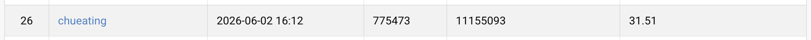

# VRDL HW4 — Image Restoration (PromptIR)

Train a single PromptIR model that restores both **rain-** and **snow-**degraded
images. From scratch (no pretrained weights), no external data.

## Environment Setup

```bash
uv sync
```

Python 3.11 + PyTorch 2.5.1 (CUDA 12.4).

## Dataset Layout

```
data/
├── train/
│   ├── degraded/
│   │   ├── rain-1.png ... rain-1600.png
│   │   └── snow-1.png ... snow-1600.png
│   └── clean/
│       ├── rain_clean-1.png ... rain_clean-1600.png
│       └── snow_clean-1.png ... snow_clean-1600.png
└── test/
    └── degraded/
        ├── 0.png ... 99.png   # mixed rain + snow, type unknown
```

## Usage

```bash
# Train baseline (PromptIR, L1, AdamW, cosine LR with warmup, AMP)
CUDA_VISIBLE_DEVICES=0 .venv/bin/python -m src.main train \
    --config configs/baseline.yaml --out-dir outputs/baseline

# Generate pred.npz on test set
CUDA_VISIBLE_DEVICES=0 .venv/bin/python -m src.main predict \
    --ckpt outputs/baseline/best.pt --out pred.npz [--tta]
```

Training writes to `outputs/<run>/`:
- `best.pt`, `last.pt` — checkpoints
- `history.json` — per-epoch loss / PSNR
- `tb/` — TensorBoard logs

Throughput (RTX 4090, batch=8, patch=128, AMP): **~81 s/epoch**, 120 epochs ≈ 2.7 hr.

## Performance Snapshot

Best public leaderboard result: **31.51 PSNR** with `submission_v3_tta8.zip`.



| Run / submission | Epochs | Val PSNR | Public PSNR | Notes |
|---|---:|---:|---:|---|
| `submission_notta.zip` | 120 | 29.628 | 29.81 | Baseline PromptIR, no TTA |
| `baseline-tta.zip` | 120 | 29.628 | 30.05 | Baseline PromptIR + TTA |
| `submission_v4_notta.zip` | 120 | 30.120 | 30.08 | SimpleGate + Charbonnier + FFT + EMA |
| `submission_v4_tta8.zip` | 120 | 30.120 | 30.31 | v4 + D4 TTA-8 |
| `submission_v2_tta8.zip` | 120 | 29.825 | 30.26 | v4 + AdaIR prompt, crop 128 |
| `submission_v3_tta8.zip` | 200 | **30.648** | **31.51** | v2 architecture, crop 192, longer training |
| `submission_ensemble_v2_v3_v4_tta8.zip` | - | - | 30.91 | Prediction average ensemble |
